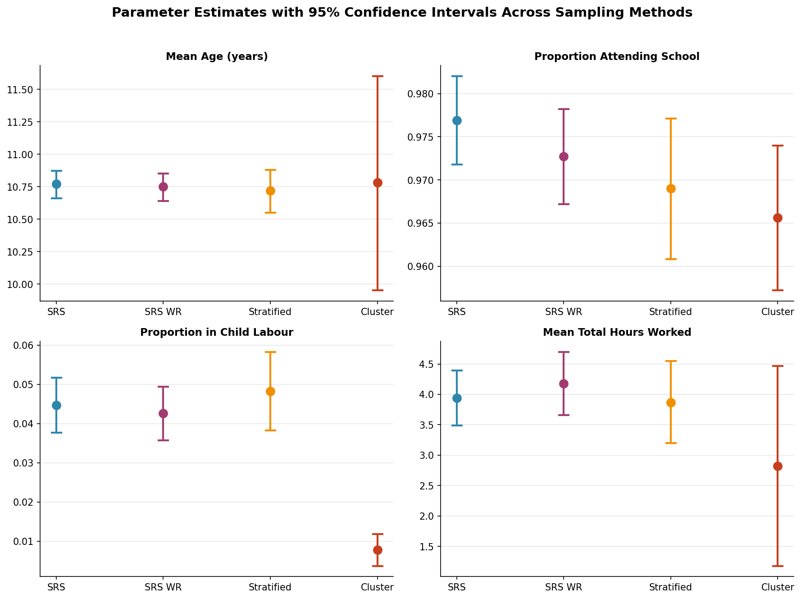
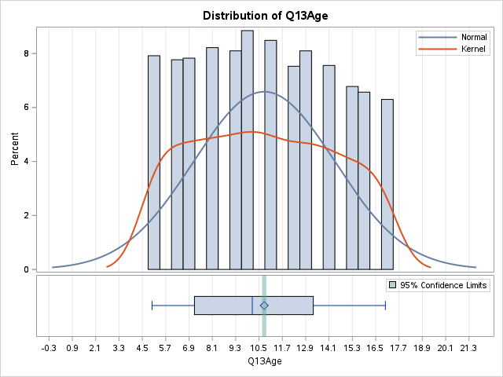
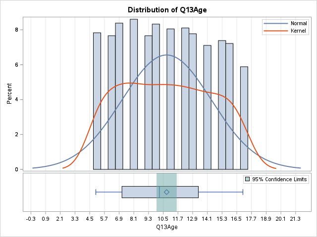

# Comparing Probability Sampling Designs: Evidence from South Africa's Survey of Activities of Young People (2019)

A statistical sampling study comparing four probability sampling designs — **Simple Random Sampling (SRS)**, **SRS with Replacement**, **Stratified Sampling**, and **Cluster Sampling** — on a national dataset of South African children, to determine which design yields the most precise and reliable estimates for key wellbeing and child labour indicators.

**Tools:** SAS (PROC SURVEYSELECT, SURVEYMEANS, SURVEYFREQ) · Excel/xlsx data source · South African Department of Statistics microdata

---

## Table of Contents

- [Overview](#overview)
- [Aim of the Study](#aim-of-the-study)
- [Data](#data)
- [Methodology](#methodology)
- [Results](#results)
- [Visual Comparison](#visual-comparison)
- [Discussion & Conclusion](#discussion--conclusion)
- [Repository Structure](#repository-structure)
- [Reproducing the Analysis](#reproducing-the-analysis)
- [Author](#author)

---

## Overview

Governments and researchers routinely rely on sample surveys — rather than a full census — to estimate national indicators such as school attendance and child labour prevalence. **Which sampling design to use matters**: it directly affects how much sampling error the resulting estimates carry, and therefore how much confidence policymakers can place in them.

This project uses microdata from Statistics South Africa's **Survey of Activities of Young People (SAYP) 2019** (13,336 children aged 5–17) to design and execute four probability sampling schemes in SAS, and compares the resulting point estimates and 95% confidence intervals for four indicators of child wellbeing.

## Aim of the Study

The aim of this study is to estimate key parameters concerning the status of South African children aged 5–17 years — specifically the **mean age**, the **proportion currently attending school**, the **proportion involved in child labour**, and the **total hours worked**. A critical secondary aim is to evaluate the performance of four different sampling methods to determine which provides the most reliable estimates for these parameters, as indicated by the narrowest confidence intervals.

## Data

**Source:** [Survey of Activities of Young People (SAYP) 2019](https://www.statssa.gov.za/), Statistics South Africa — 13,336 cases, 136 variables.

| Variable | Type | Description |
|---|---|---|
| `Q13Age` | Continuous | Age of child (5–17 years) |
| `TotalHours` | Continuous | Total hours worked per week (market + non-market activity) |
| `Q22Attend` | Categorical | Currently attending school (1 = Yes) |
| `Child_Labour` | Categorical (derived) | Involved in at least one form of child labour (1 = Yes) |
| `Q12Gender` | Categorical | Gender — used as the **stratification** variable |
| `Province` | Categorical | One of 9 South African provinces — used as the **clustering** variable |

Full variable-level documentation (universe, literal question text, valid/missing counts) is in [`docs/Data_Description.pdf`](docs/Data_Description.pdf).

## Methodology

Four probability sampling designs were implemented in SAS using `PROC SURVEYSELECT` (selection), `PROC SURVEYMEANS` (continuous variable estimation) and `PROC SURVEYFREQ` (proportion estimation), each seeded identically (`seed=202502`) for comparability.

| # | Design | Mechanism | Sample size |
|---|---|---|---|
| 1 | **Simple Random Sampling (SRS)** | Pure random sample without replacement from the full national frame | n = 3,334 |
| 2 | **SRS With Replacement (URS)** | Random sample allowing repeated selection of the same individual | n = 3,334 |
| 3 | **Stratified Sampling** | Population split into 2 strata by `Q12Gender`; proportionally allocated SRS drawn within each stratum | n = 1,741 |
| 4 | **Cluster Sampling** | Population split into 9 clusters by `Province`; 2 provinces randomly selected, all children within them surveyed | n = 1,801 (2 clusters) |

Full SAS code is provided in [`code/sampling_analysis.sas`](code/sampling_analysis.sas).

## Results

### A. Mean Age (`Q13Age`)

| Sampling Method | Mean Estimate (years) | 95% Confidence Interval | CI Width |
|---|---|---|---|
| SRS | 10.77 | (10.66, 10.87) | 0.21 |
| SRS WR | 10.75 | (10.64, 10.85) | 0.21 |
| Stratified | 10.72 | (10.55, 10.88) | 0.33 |
| Cluster | 10.78 | (9.95, 11.60) | 1.65 |

### B. School Attendance (`Q22Attend = 1`)

| Sampling Method | Proportion Estimate | 95% Confidence Interval | CI Width |
|---|---|---|---|
| SRS | 0.9769 | (0.9718, 0.9820) | 0.0102 |
| SRS WR | 0.9727 | (0.9672, 0.9782) | 0.0110 |
| Stratified | 0.9690 | (0.9608, 0.9771) | 0.0163 |
| Cluster | 0.9656 | (0.9572, 0.9740) | 0.0168 |

### C. Child Labour (`Child_Labour = 1`)

| Sampling Method | Proportion Estimate | 95% Confidence Interval | CI Width |
|---|---|---|---|
| SRS | 0.0447 | (0.0377, 0.0517) | 0.0140 |
| SRS WR | 0.0426 | (0.0357, 0.0494) | 0.0137 |
| Stratified | 0.0482 | (0.0382, 0.0583) | 0.0201 |
| Cluster | 0.0078 | (0.0037, 0.0118) | 0.0081 |

### D. Total Hours Worked (`TotalHours`)

| Sampling Method | Mean Estimate (hours) | 95% Confidence Interval | CI Width |
|---|---|---|---|
| SRS | 3.94 | (3.49, 4.39) | 0.90 |
| SRS WR | 4.18 | (3.66, 4.70) | 1.04 |
| Stratified | 3.87 | (3.20, 4.55) | 1.35 |
| Cluster | 2.82 | (1.18, 4.47) | 3.29 |

## Visual Comparison

The chart below overlays all four indicators, making the difference in precision between designs immediately visible — cluster sampling's confidence intervals are consistently the widest, and for child labour, its point estimate is a clear outlier.



**Sample SAS output — age distribution under SRS vs. Cluster sampling:**

| SRS | Cluster |
|---|---|
|  |  |

*(Additional SAS output for every design — including the `TotalHours` distributions and the full `SURVEYFREQ` tables — is preserved in the [`docs/`](docs/) results appendix referenced in the presentation.)*

## Discussion & Conclusion

A very high proportion of children (over 96.5%) are estimated to be attending school across all four methods. The estimated proportion involved in child labour varies more considerably by method, ranging from 0.78% to 4.82% — over a six-fold spread depending on which design was used to sample the same population.

**Precision, measured by confidence interval width, differed markedly by design:**

- **Simple Random Sampling (SRS)** consistently produced the most precise and reliable estimates across all four parameters, with the narrowest confidence intervals for mean age, school attendance, and child labour.
- **Stratified Sampling** performed well for mean age but showed slightly wider intervals for proportions and total hours than SRS, indicating a modest loss of precision — likely because gender is not strongly associated with these particular outcomes, so stratifying on it captured less between-stratum variance than hoped.
- **Cluster Sampling** performed the poorest, yielding extremely wide and, for child labour, implausible confidence intervals. Its child labour estimate (0.78%) is a stark outlier against the ~4.5% reported by every other method — a textbook illustration of the design effect that arises when only 2 of 9 primary sampling units are selected and units within a cluster (province) are more similar to each other than to the population at large.

**Conclusion:** for this national survey of South African children, **Simple Random Sampling is the most reliable method**, providing the most precise estimates and making it the preferred choice for informing policy and intervention strategies. Cluster sampling, while operationally cheaper to field (only 2 provinces need to be visited), introduced significant bias and variability for these specific variables and is not recommended when precise national estimates are the priority.

## Repository Structure

```
.
├── README.md                          # This file — full write-up of the study
├── code/
│   └── sampling_analysis.sas          # SAS code for all four sampling designs
├── docs/
│   └── Data_Description.pdf           # Full SAYP 2019 variable documentation
├── presentation/
│   └── Statistics_Project_Presentation.pptx
└── assets/                            # Charts and SAS plot output used in this README
```

> **Note on data:** the raw `SAYP_data.xlsx` microdata file is not included in this repository due to its size and because it is third-party survey data. It can be requested from [Statistics South Africa](https://www.statssa.gov.za/) or DataFirst.

## Reproducing the Analysis

1. Obtain the SAYP 2019 microdata (`SAYP.xlsx`) from Statistics South Africa / DataFirst.
2. Update the `libname` path at the top of `code/sampling_analysis.sas` to point to your local copy.
3. Run the script in SAS (SAS OnDemand for Academics or SAS Studio both work) section by section — each `PROC SURVEYSELECT` block draws a sample, and the following `PROC SURVEYMEANS` / `PROC SURVEYFREQ` blocks generate the estimates reported above.
4. All four designs use `seed=202502` for reproducibility.

## Author

**Awande** — BSc Honours in Statistics, University of KwaZulu-Natal (Pietermaritzburg)
Completed as part of the STAT395 sampling methods module.
